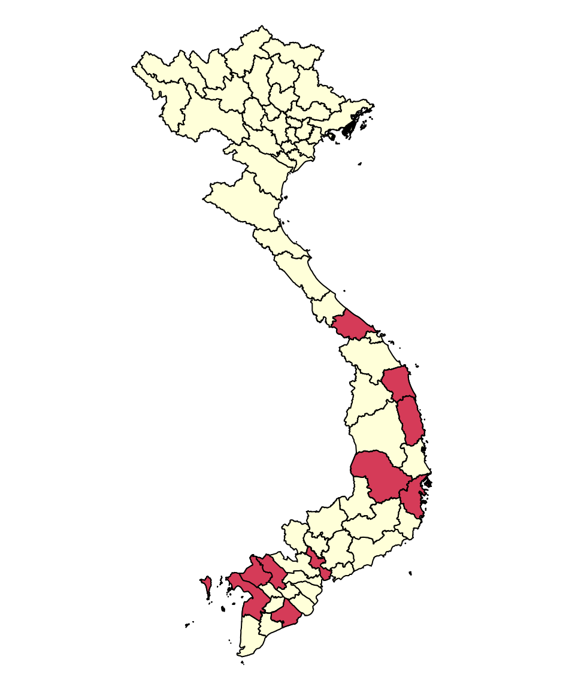
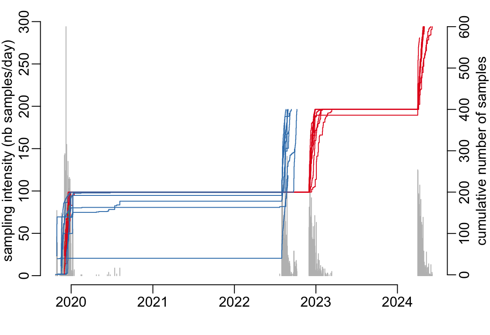
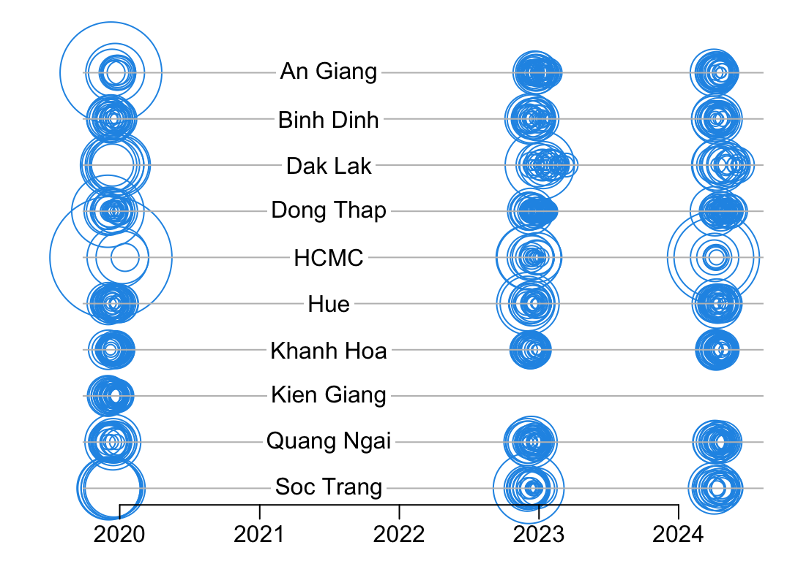
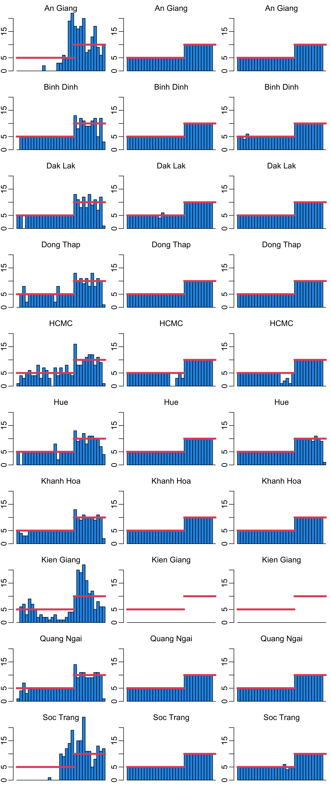
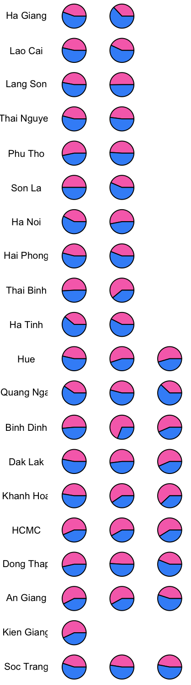
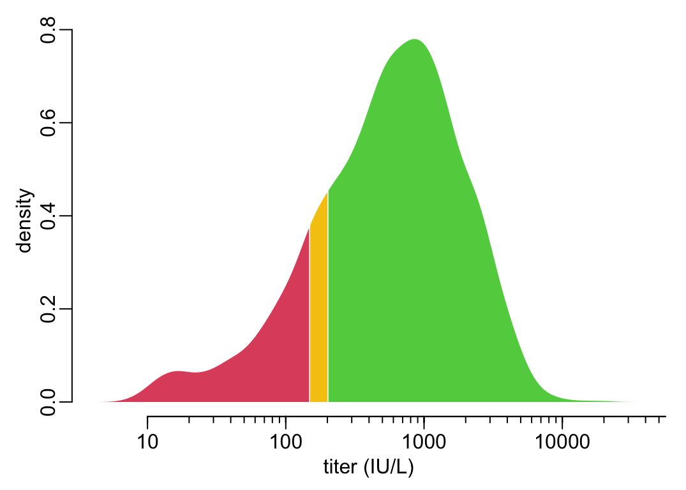
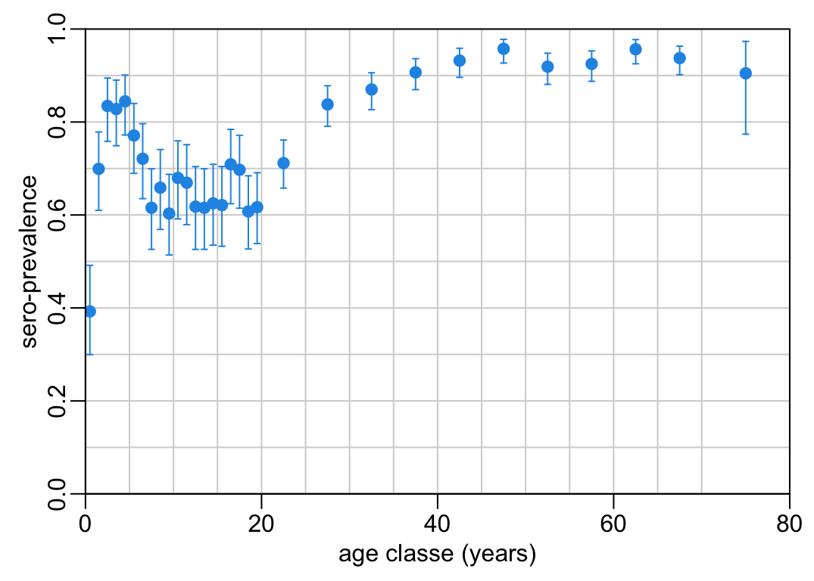
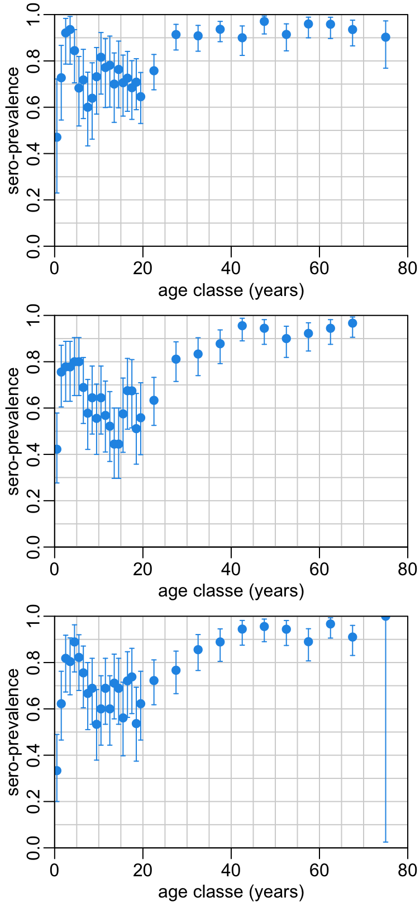

```{r include = FALSE}
knitr::opts_chunk$set(echo = FALSE)

if (grepl("arc|hoisy", Sys.getenv("USER"))) {
  path2data <- paste0("~/Library/CloudStorage/OneDrive-OxfordUniversityClinical",
                      "ResearchUnit/GitHub/choisy/measles serology/")
}
path2cache <- paste0(path2data, "cache/")
make_path <- function(x) paste0(path2cache, x)
readRDScache <- function(x) readRDS(make_path(x))
```

::: {.callout-note}
Full analysis (with R code): [https://choisy.github.io/measles_serology](https://choisy.github.io/measles_serology)

GitHub repository: [https://github.com/choisy/measles_serology](https://github.com/choisy/measles_serology)

Leave comments or make suggestions by posting an issue [here](https://github.com/choisy/measles_serology/issues) (click on the green button in the top right corner).
:::

The locations of provinces on the map:

{#fig-map width=470px}

The number of samples per time point per province:

```{r}
readRDScache("nb_samples_prov_timepoint.rds")
```

{#fig-sampling_intensity width=537.5px}

{#fig-nb_sample_day_site width=537.5px}

{#fig-nb_samples_site_timepoint_ageclass width=672px}

{#fig-sex_distribution width=470px}

{#fig-distribution_titers width=537.5px}

{#fig-distribution_titers_timepoints width=376px}

{#fig-age_profile width=537.5px}

{#fig-age_profile_timepoints width=376px}

{#fig-seroprevalence_trends width=806px}
